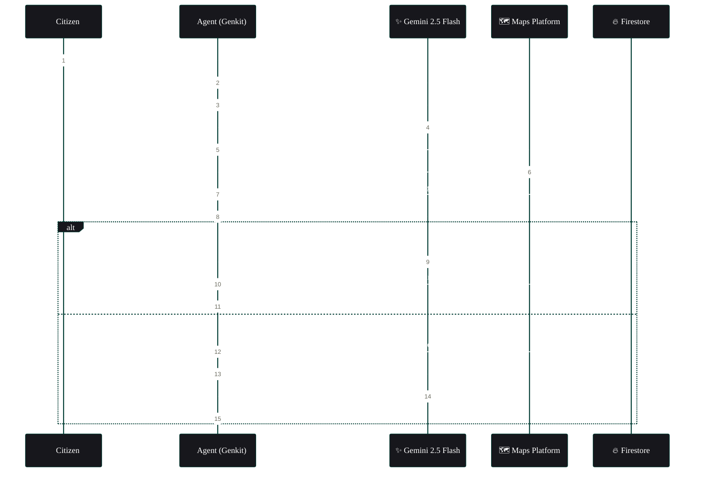
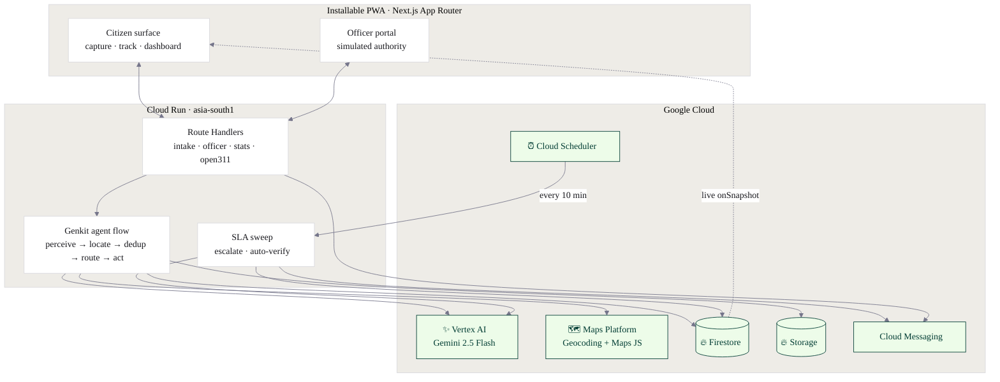
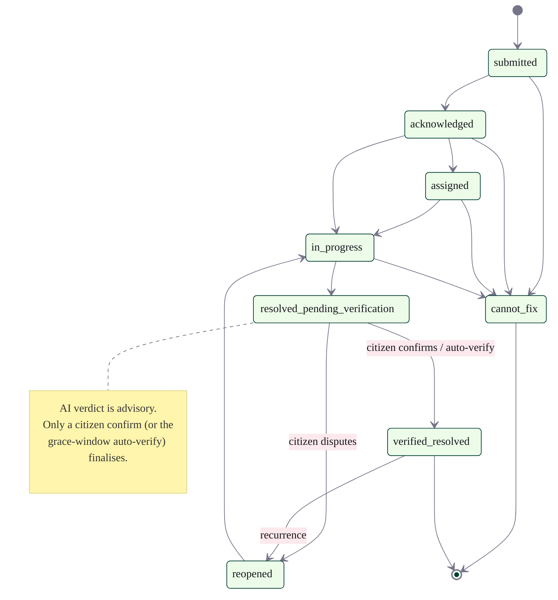
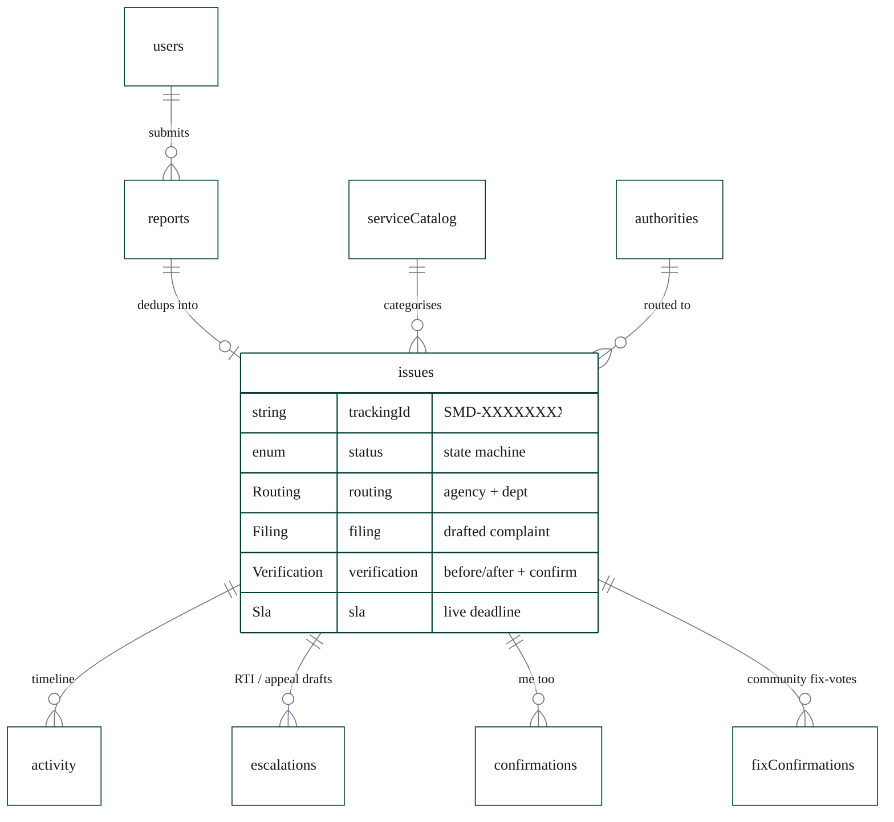

<div align="center">

# समाधान · Samadhan

### An AI **Civic Resolution Agent** — not a reporting app, a *resolution* layer.

**From report to resolution — not report and forget.**

[](https://samadhan-554128679437.asia-south1.run.app) [](https://samadhan-554128679437.asia-south1.run.app)


*Built for **Vibe2Ship** — Coding Ninjas × Google for Developers · Problem Statement 2: Community Hero (Hyperlocal Problem Solver)*

</div>

---

## The one-screen pitch

Indian cities don't lack a way to **report** civic problems — potholes, garbage, dead streetlights, water leaks, sewer overflows, power cuts. They lack a way to **resolve** them. Every existing app logs the complaint, hands the work back to an overloaded municipal body, and leaves the citizen in silence: no tracking, no accountability, no fix. Reports pile up as duplicates; SLAs lapse unnoticed; "resolved" is whatever the department says it is.

**Samadhan is the missing resolution-and-accountability layer.**

A citizen snaps one photo. From there an **autonomous, multi-step AI agent** does the bureaucratic labour: it **perceives** the issue, **locates** it, **de-duplicates** it against nearby reports, **routes** it to the correct authority, **drafts and files** the formal complaint in the citizen's own language, **tracks** the real SLA, **escalates to an RTI** when the deadline breaches, and **independently verifies** the fix with before/after vision — before anyone is allowed to call it *resolved.*

> The loop actually closes. And "resolved" finally means something.

---

## The three standout moments

The product is built around three beats where the agent does work a reporting app never would:

| | Moment | What the citizen sees |
|:--:|---|---|
| **1** | 🔁 **Dedup** | Snap an already-reported issue → instead of creating report #51, the agent says *"14 citizens already reported this — your photo adds weight,"* and links you to the live case. |
| **2** | ✍️ **Action** | The agent doesn't just log it — it **drafts the formal complaint** in the right department's format and language, and files it under a tracking ID, on one tap. |
| **3** | ⏱️ **Escalation** | SLA breached → a scheduled sweep has the agent **autonomously draft the next rung** (reminder → higher-authority appeal → **RTI application**), notify the citizen, and offer one-tap send. |

And the part that makes *resolved* honest — **before/after verification**: when the authority uploads a proof-of-fix photo, Gemini runs an independent visual verdict, and the status only becomes *verified resolved* when the **citizen confirms**. The AI never auto-closes.

---

## How the loop closes

```mermaid
%%{init: {'theme':'base','themeVariables':{'primaryColor':'#edfce9','primaryTextColor':'#17171c','primaryBorderColor':'#003c33','lineColor':'#75758a','secondaryColor':'#f1f5ff','tertiaryColor':'#ffffff','fontFamily':'ui-sans-serif'}}}%%
flowchart LR
    START(["📸 Citizen snaps<br/>a civic problem"]):::citizen

    subgraph AGENT ["Civic Resolution Agent · one autonomous run"]
        direction LR
        P[Perceive]:::ai --> L[Locate]:::map --> D[Dedup]:::ai --> R[Route]:::rule --> A[Act]:::ai
    end

    START --> AGENT
    A --> FILED(["🏛️ Formal complaint filed<br/>· tracking ID · in citizen language"]):::done
    FILED --> TRACK["Track<br/>real SLA clock"]:::neutral
    TRACK -->|breached| ESC["Escalate<br/>reminder → appeal → RTI"]:::warn
    TRACK --> OFF["Officer acts<br/>uploads proof photo"]:::neutral
    OFF --> VER["Verify<br/>before/after vision verdict"]:::ai
    VER --> CONF(["✅ Verified resolved<br/>only when the citizen confirms"]):::done

    classDef citizen fill:#ffffff,stroke:#17171c,stroke-width:2px,color:#17171c;
    classDef ai fill:#edfce9,stroke:#003c33,stroke-width:1.5px,color:#003c33;
    classDef map fill:#f1f5ff,stroke:#1863dc,color:#1863dc;
    classDef rule fill:#eeece7,stroke:#75758a,color:#17171c;
    classDef warn fill:#fff1ec,stroke:#ff7759,stroke-width:1.5px,color:#b3402a;
    classDef done fill:#003c33,stroke:#003c33,color:#ffffff;
    classDef neutral fill:#ffffff,stroke:#d9d9dd,color:#17171c;
```



**Everyone else stops at "filed."** Samadhan owns everything to the right of it — the tracking, the autonomous escalation, and the honest verification.

---

## Agentic depth — a real agent, not a chatbot

The intake pipeline is a **visible, multi-step Genkit flow over Gemini 2.5 Flash**. Each step renders live in a dark "agent console" as the server writes it — the autonomy *is* the demo. It's an agent with real **tools** (vision, geocoding, Firestore transactions, push, a scheduler), each step independently traced, retried, and idempotent.



> Perceive is wrapped so a non-retryable model error recovers to `needs_review` instead of freezing; the LINK/SEED writes are atomic Firestore transactions that re-read inside the txn, so a double-submit can never duplicate or merge into a closed case.

---

## Google technologies — load-bearing, not bolted on

| Technology | How it carries the product |
|---|---|
| **Gemini 2.5 Flash** *(Vertex AI, via Genkit)* | The agent's brain end-to-end: vision **classification + severity + OCR + language detection** (Perceive), **multi-image same-issue comparison** (Dedup), **formal-complaint drafting** in the citizen's language (Act), **before/after resolution verdict** (Verify), **escalation + RTI drafting** (Escalate), and **voice-note transcription**. Runs on ADC — no API key. |
| **Google Maps Platform** | Server-side **reverse geocoding** (address + ward) on every report; the dashboard's **severity-weighted hotspot map**; manual **map-pin fallback** when GPS is denied. |
| **Firebase** | **Auth** (anonymous — the whole product runs without forcing sign-up), **Firestore** (the whole data model + live `onSnapshot` agent trace), **Storage** (citizen photos + before/after proof), **Cloud Messaging** (status push, verified on a real Android device). |
| **Cloud Run** | Hosts the standalone Next.js container in `asia-south1` — the "deployed on Google Cloud" requirement. |
| **Cloud Scheduler** | Fires the **autonomous SLA-breach sweep** every 10 min — escalation drafting + stale-resolution auto-verify, with zero human in the loop. |
| **Cloud Build · Artifact Registry · Secret Manager** | The build / deploy / secrets pipeline. |

---

## See it live

🔗 **[samadhan-554128679437.asia-south1.run.app](https://samadhan-554128679437.asia-south1.run.app)** — installable PWA, mobile-first.

- **`/`** — snap → watch the live agent console → land on a tracked issue.
- **`/dashboard`** — the public impact layer: resolution rate, median time-to-resolve, and a Bengaluru hotspot map *(leads with honest outcomes, never vanity report counts)*.
- **`/officer`** — the simulated municipal side: a support-sorted queue and the full action ladder.

> **Fastest path for a judge:** open **`/`**, photograph a civic problem (pothole, garbage, a broken light) and watch the agent console run *perceive → locate → dedup → route → act* end-to-end — then report the same spot again to fire the **dedup** moment.

---

## Key features

- **Frictionless capture** — one tap: photo + auto-GPS, optional voice note (Gemini-transcribed), near-zero typing; manual map-pin fallback when GPS is denied.
- **Live agent console** — the pipeline animates step-by-step with per-step latency and Google-tech badges.
- **Dedup & amplify** — duplicate reports merge into one issue with a rising supporter count and a one-tap "me too."
- **Correct-authority routing + drafted complaint** — pothole → **BBMP**, water leak → **BWSSB**, power outage → **BESCOM**, each filed **in the citizen's own language** (English / Kannada / … auto-detected), so non-English speakers aren't shut out of civic redress.
- **Real SLA clock** — on-track / due-soon / breached, sourced from citizen-charter timeframes, with push notifications.
- **Autonomous escalation** — reminder → appeal → RTI, drafted on breach by the scheduler sweep, with one-tap send.
- **Honest verification** — Gemini before/after verdict + mandatory citizen confirm; community fix-votes; reopen on a bad fix.
- **Officer / authority portal** — support-sorted queue + acknowledge → assign → start → resolve (proof photo required) → cannot-fix.
- **Public impact dashboard** — resolution rate, median time-to-resolve, recurring-hotspot wards, recently-resolved before/after strip.
- **Open311 interoperable** — the dataset exports in the GeoReport v2 standard.
- **Installable PWA** — mobile-first, motion-rich, accessible.

---

## What's real vs simulated

Everything in the loop is real software: the agent, the Gemini calls, the geocoding, the Firestore data model, the SLA engine, the escalation drafting, the verification, the push notifications, and the Open311 export. The **municipal / officer side is simulated in-app** — there is no public government write-API to file into — so the full loop (file → officer acts → status → verify → escalate) is demonstrable end-to-end. Real government-portal integration is the roadmap. **No fabricated official identities, logos, or numbers** are used anywhere; authority data carries only verifiable public facts.

---

# For builders

## System architecture



## Under the hood

<details>
<summary><b>Issue lifecycle — the status state machine</b></summary>



</details>

<details>
<summary><b>Data model — Firestore collections</b></summary>



The full contract — every field, type, index, and security-rule intent — lives in [`data-shapes.md`](data-shapes.md).

</details>

<details>
<summary><b>Open311 interoperability — GeoReport v2 export</b></summary>

The issue model maps to the **Open311 GeoReport v2** civic standard and exports at a public endpoint — so the dataset interoperates with the existing ecosystem rather than replacing it.

```bash
GET /api/open311/requests                       # GeoReport v2 service_requests (JSON array)
GET /api/open311/requests?format=xml            # GeoReport v2 XML
GET /api/open311/requests?status=open|closed&service_code=<code>
```

</details>

## Tech stack

- **Next.js 16** (App Router, TypeScript, Turbopack, standalone output) + **Tailwind v4** — installable PWA on **Cloud Run**.
- **Firebase** (client SDK + `firebase-admin`, ADC) — Auth · Firestore · Storage · Cloud Messaging.
- **Genkit** + `@genkit-ai/google-genai` orchestrating **Gemini 2.5 Flash** on **Vertex AI**.
- **Google Maps Platform** — Geocoding (server) + Maps JavaScript (client heatmap).
- Data modelled on **Open311 GeoReport v2**.

## Run it locally

```bash
cd samadhan
npm install
npm run dev          # http://localhost:3030

# server-side Google calls (Gemini via Vertex, Admin SDK) use ADC:
gcloud auth application-default login

# seed reference data (catalogue + authorities + officers):
node scripts/seed.mjs
# seed the canonical demo dataset (lights up /dashboard):
node scripts/seed-demo.mjs            # idempotent; --cleanup removes it
```

Public config lives in `.env.local` (`NEXT_PUBLIC_*`, gitignored); server secrets live in Secret Manager. The build is a multi-stage `node:24-slim` Docker image deployed via **Cloud Build → Cloud Run**.

## Repository layout

```
/                     planning + spec docs (the source of truth)
  CLAUDE.md           how we build (the project constitution)
  data-shapes.md      data source of truth — Firestore + agent I/O + Open311 mapping
  DESIGN.md           visual source of truth (design system)
  backend-plan.md     backend build spec (chunk by chunk)
  frontend-plan.md    frontend build spec (chunk by chunk)
  progress.md         running build log (reality)
  SUBMISSION.md       the submission write-up
/samadhan             the Next.js application
  src/genkit/         the agent — flow + steps (perceive/locate/dedup/route/act/verify/escalate/transcribe)
  src/app/api/        server endpoints — intake · officer · stats · issues/geo · open311 · internal/sla-sweep …
  scripts/            seed (reference data) + seed-demo (canonical demo dataset)
/docs                 runbooks
```

## Roadmap

Deliberately out of scope for this build, in priority order: **phone-OTP sign-in** (save reports across devices; the product runs on anonymous auth today) · **watch-your-ward** area subscriptions · two-way officer ↔ citizen messages · a pre-submission nearby-issue nudge · full UI internationalisation (the *complaint* is already filed in the citizen's language) · WhatsApp + video intake · real government-portal integration · predictive hotspot analytics.

---

<div align="center">

**Samadhan** — समाधान, *"resolution."*
Built solo for Vibe2Ship · Coding Ninjas × Google for Developers.

See [`progress.md`](progress.md) for the full build log and [`SUBMISSION.md`](SUBMISSION.md) for the submission write-up.

</div>
